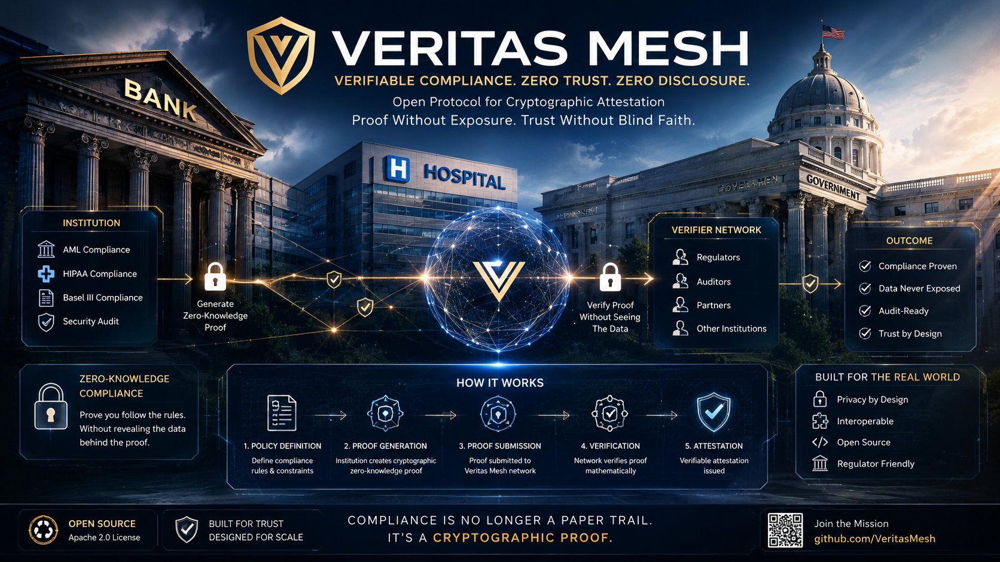

<div align="center">



# 💚 Support Veritas Mesh

### **Verifiable Compliance Infrastructure for the Next Generation of Trust**

<sub>
Open research • Apache-2.0 • Community Driven • No Vendor Lock-in
</sub>

</div>

<br>


# Why support Veritas Mesh?

Veritas Mesh is an independent open-source research initiative building a new foundation for **cryptographically verifiable compliance**.

Instead of asking organizations to simply claim they followed regulations, Veritas Mesh enables them to **mathematically prove** compliance while preserving confidentiality.

The project explores technologies including:

- Zero-Trust compliance
- Verifiable audit trails
- Policy-as-Code
- Cryptographic attestations
- Privacy-preserving verification
- Cross-institution interoperability
- AI governance and regulatory automation

Everything is developed openly.

No subscriptions.

No enterprise paywall.

No proprietary lock-in.

Your support helps fund:

- development of new protocol specifications
- security research
- documentation
- reference implementations
- interoperability testing
- community infrastructure
- long-term maintenance

---

<div align="center">

```text
╔══════════════════════════════════════════════╗
║    VERIFY • PROVE • TRUST • COMPLY          ║
║        ███ MATRIX NETWORK ONLINE ███        ║
╚══════════════════════════════════════════════╝
```

</div>


# Cryptocurrency

<div align="center">

| Network | Address |
|:--------:|:--------|
| **Bitcoin (BTC)** | `bc1qf3yy0w8z37rwavxpu38wem3yffpanw7wzj32qj` |
| **Ethereum (ETH)** | `0x27d9a6a5b8507e6031bb044319410da96222d402` |
| **Solana (SOL)** | `DPfrKx9VVwP4CUnWXxfrvTP5rjSCzaE132jmvLWXcBzP` |

</div>

> ⚠️ Always verify wallet addresses directly from this repository before making a transfer. Clipboard hijacking malware exists. When possible, send a small test transaction first.


# Bank Transfer

### USD

```text
Name:            Ciprian Stefan Plesca
Account Type:    Checking
Routing Number:  026073150
Account Number:  8314225367
BIC/SWIFT:       CMFGUS33

Community Federal Savings Bank
89-16 Jamaica Ave
Woodhaven, NY 11421
USA
```

### EUR

```text
Name:      Ciprian Stefan Plesca
IBAN:      BE83 9679 1975 8915
BIC/SWIFT: TRWIBEB1XXX

Wise
Rue du Trône 100
Brussels
Belgium
```

For updated banking information or RON transfers, please contact the repository owner through GitHub.


# GitHub Sponsors

If GitHub Sponsors is enabled, simply click the **❤️ Sponsor** button on the repository.

GitHub securely processes all payments.


# Support Without Donating

Every contribution strengthens the ecosystem.

### ⭐ Star the repository

Visibility helps researchers, developers and institutions discover Veritas Mesh.

---

### 🐛 Report Issues

Found a bug, ambiguity or edge case?

Open an Issue.

---

### 🔒 Review Security

Security reviews, protocol analysis and responsible disclosure are invaluable.

---

### 🔧 Contribute Code

Improve:

- protocol modules
- verification engines
- SDKs
- documentation
- dashboards
- policy libraries
- integrations

See **CONTRIBUTING.md**

---

### 📚 Cite Veritas Mesh

Academic references, conference talks and research citations greatly increase adoption.

---

### 🌍 Share the Project

If you believe transparent and verifiable compliance should become a public standard rather than proprietary software, share Veritas Mesh with your network.

<?xml version="1.0" encoding="UTF-8"?>
<div align="center">


</div>

<div align="center">

```text
█████████████████████████████████████████████████

      CONNECTING TRUST
      THROUGH VERIFIABLE PROOF

█████████████████████████████████████████████████
```

### 💚 Every contribution helps build open compliance infrastructure.

**Thank you for supporting independent open-source research.**

</div>
